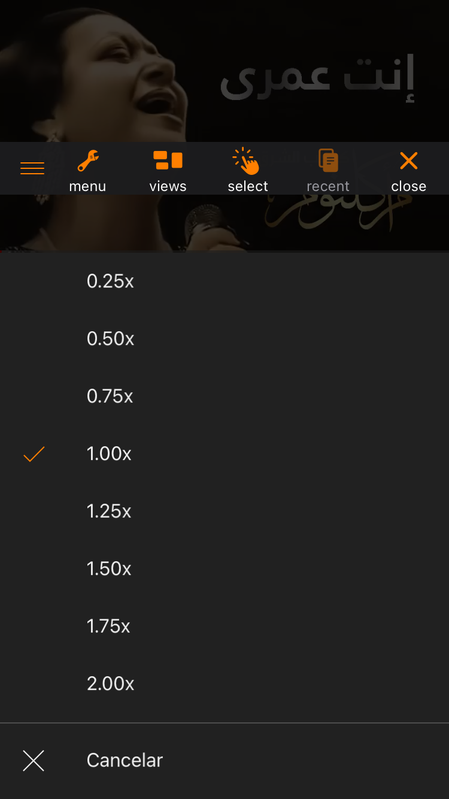

# YTSpeed2

**More speed control options for the YouTube app**

**By Ahmad Mokadam**

*Compatible with the latest version of YouTube 19.09.3*

---

## Description

YTSpeed2 is a tweak that enhances the speed control options for YouTube, offering a broader range of playback speeds. It is built upon the original [YTSpeed](https://github.com/therealFoxster/YTSpeed/blob/3ddaf3d0e1b49b69a428d1ac877cf3bde8dd0861/Tweak.xm) tweak and introduces more choices for a customizable and enjoyable watching experience.

## Features

- **Extended Speed Options**: Enjoy a broader range of playback speeds, including 0.25x, 0.5x, 1.5x, 2.5x, and more.

- **User-Friendly Controls**: Easily adjust playback speed to suit your preferences, whether you're watching tutorials, lectures, or entertainment content.

- **Latest YouTube Version Support**: YTSpeed2 is compatible with the [latest YouTube app version (19.09.3)](https://github.com/Lyvendia/YTSpeed/blob/main/Tweak.xm), ensuring a seamless experience.

## YouTubeHeader

 **YouTubeHeader**: Get From [YouTubeHeader](https://github.com/PoomSmart/YouTubeHeader/) .

## Acknowledgments

Special thanks to [therealFoxster](https://github.com/therealFoxster) and [Lyvendia](https://github.com/Lyvendia) for their contributions to the original YTSpeed tweak.

## Support and Feedback

If you encounter any issues or have suggestions for improvement, please [open an issue](https://github.com/AhmadMokadam/YTSpeed2/issues) on the GitHub repository.

---

*This project is not affiliated with or endorsed by YouTube.*
